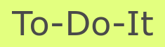

<!-- Badges -->
<p>
  
  <a href="#" target="_blank">
    
  </a>
  <a href="https://twitter.com/redacuve" target="_blank">
    
  </a>
  <a href="https://twitter.com/RicardoValtie15" target="_blank">
    
  </a>
</p>


<!-- Project Header -->
  <p align="center">
    
  <br>
  <h1 align="center">Project To Do List</h1>
  <p align="center">
  <br>
   <a href="https://github.com/redacuve/to-do-js"><strong>Explore the repo »</strong></a>
  <br>
    <a href="https://github.com/redacuve/to-do-js/issues">Request Feature</a>
  </p>
  <h2 align="center"><a href="https://raw.githack.com/redacuve/to-do-js/todo-list/dist/index.html"><strong>Live Link!</strong></a></h2>

<!-- TABLE OF CONTENTS -->

## Table of Contents

* [About the Project](#about-the-project)

* [Built With](#built-with)

* [Getting Started](#getting-started)

* [How it Works](#how-it-works)

* [Contributing](#contributing)

* [License](#license)

* [Contact](#contact)

* [Acknowledgements](#acknowledgements)

<!-- ABOUT THE PROJECT -->

## About The Project

This is a little web app where you can add a list of to-do things over a project, also you can check complete every task you have completed.

It is RESTFUL because you can create, read, update, or delete the list of to-do or projects.

With To-Do app you can check if a task is done or if need to work with them. everything is simpler.

Don't worry about lose your to-dos because it are stored in your machine.

Feel free to use and recommend this app.

For more details about this project and it's requeriments go to <a href="https://www.theodinproject.com/courses/javascript/lessons/todo-list"> The Odin Project</a>


### Built With

* [HTML5](https://developer.mozilla.org/es/docs/HTML/HTML5)

* [CSS](https://developer.mozilla.org/es/docs/Web/CSS)

* [bulma](https://bulma.io/documentation/)

* npm Packages used:
    * [bulma](https://www.npmjs.com/package/bulma)

<!-- GETTING STARTED -->

## Getting Started

To get a local copy up and running follow these simple steps.

Clone or fork the <a href="https://github.com/redacuve/to-do-js">repo</a> [git@github.com:redacuve/to-do-js.git]

*note you need have install npm or yarn
* [npm](https://www.npmjs.com/get-npm)
* [yarn](https://classic.yarnpkg.com/en/docs/install)


<!-- HOW IT WORKS -->
## How it Works

This webpage is built with pure Javascript, it needs webpack to proper use because has various imports of code, it has his own classes, and it has various little helper functions, all of the .js files are located inside /src folder, the images are inside /src/assets folder.

### Running the code

*   Navigate to the root directory of the project

*   Run this command on your terminal to add all the required packages and dependencies
    ```
    $ npm install
    ```
*   Also, you can build this webpage for production, this app it's going to be saved inside the /dist folder, here we can see a main.js file, this is a minified file of the previous files thar are located inside /src folder.
    ```
    $ npm run build
    ```
*   Now the app is ready, you can open the index.html inside /dist folder.


<!-- CONTRIBUTING -->

## Contributing

Contributions are what make the open source community such an amazing place to be learn, inspire, and create. Any contributions you make are **greatly appreciated**.

1. Fork the Project

2. Create your Feature Branch (`git checkout -b feature/AmazingFeature`)

3. Commit your Changes (`git commit -m 'Add some AmazingFeature'`)

4. Push to the Branch (`git push origin feature/AmazingFeature`)

5. Open a Pull Request

<!-- LICENSE -->

## License

This project is under the <a href="https://www.gnu.org/licenses/gpl-3.0.html">GNU Public License V3</a>. For more information see <a href="https://github.com/redacuve/restaurant-page/blob/master/LICENSE">here</a>

<!-- CONTACT -->

## Contact

Rey David Cuevas Vela - [@redacuve](https://twitter.com/redacuve) - redacuve@gmail.com - [linkedin.com/in/redacuve/](https://www.linkedin.com/in/redacuve/)

Ricardo Valtierra - [@RicardoValtie15](https://twitter.com/RicardoValtie15) - ricardo_valtierra@outlook.com- [https://www.linkedin.com/in/ricardovaltierra/](https://www.linkedin.com/in/ricardovaltierra/)

Project Link: [github.com/redacuve/to-do-js](https://github.com/redacuve/to-do-js) - To Do JS Project.

<!-- ACKNOWLEDGEMENTS -->

## Acknowledgements

* [Rey David Cuevas Vela](https://github.com/redacuve)

* [Ricardo Valtierra](https://github.com/ricardovaltierra)
